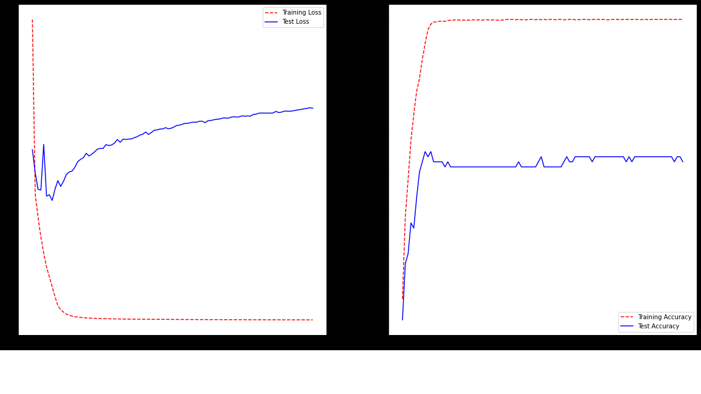

# anime vs cartoon neural network analysis

To see if we are able to classify a anime or cartoon images to create an automated process of classification.  This is after experiencing inconvenient recommendation apps in things like netflix and hulu which both do a great job at recommending shows based off of other shows watched within a category. but not curtailed to they specific type of anime.

This work is a preparatory step to create a model that will be able to classify different types of anime like. Shojo, Shonen, Yaoi or Josei.  so lets first start with cartoon distinction.

so we want to be able to differentiate the style of animation like this.

VS

# what defines either of these categories?

For most watchers of both Genres in both I think the most discerning difference is the origin of the artwork. anime being from Japan and cartoons more generally western world content as a whole.  

what does the web say?

According to this commonly circulated meme on twitter, there are a host of characteristics.  I think the key difference that this meme notes that most notice is the shapes of the heads and the development of facial  features on the face.  they say the eyes but in general the features tend to just get a little wonky for both.

# modeling
the data set for this model can be found in this repository and also at,
https://www.kaggle.com/kanakmittal/anime-and-cartoon-image-classification
this data set can also be used for anime set classification but would take some manual adjustments to determine.

I decided to use a multitude of neural network strategies and see which ones would perform better. With a few surprises of which I did not expect.

# Base model

So first we create a base model, decided to stick with a simple low level Dense NN.  

   

##### note these are all the test results:

|Accuracy|Loss|
|---------|---------|
|0.5167|0.6929|

Then we built a Convolutional NN, These are know to perform well on image data. the methodology is that each convolutional layer transforms the data into one an aggregated pixel that captures the variance of the surrounding cells of a point and not just each point alone.

   

|Accuracy|Loss|
|---------|---------|
|0.4067 |0.8800 |

Then we moved on to using some pretrained data sets since we may encounter a model that may perform better due to extensive research over time. after looking it up on other git hub projects inception_resnet_v2 and vgg19 were said to be good performing pre-sets.

## Pretrained network

### vgg19

|Accuracy|Loss|
|---------|---------|
|0.4833 |7.0834 |

### inception_resnet_v2

|Accuracy|Loss|
|---------|---------|
|0.8667 |0.3437  |

## Grid search our base model

next i decieded to run a grid search on out base model since it performed so bad during our first run. here is the best result.

|round_epochs|loss|accuracy|val_loss|val_accuracy|activation1|activation2|dropout|nodes1|optimizer|
|------|--------|----------|------|--------|-------|-------|------|-------|-------|
|100|	0.653634|	0.645072|	0.700199|	0.525301|	tanh|	relu|	0.1	|200|	sgd

we can see from these results that the best two models is the pre-trained inception_resnet_v2  I choose this model over the CNN due to it performing better on unseen data. meaning that the CNN was over fit but still very useful and can be improved!. 

# future work

in the future I would like to implement a stream lined app for a prediction function. there is starter code in the scrape code at the very bottom. I did not finish so it was not published.
then to also extend this to anime sub catagories
